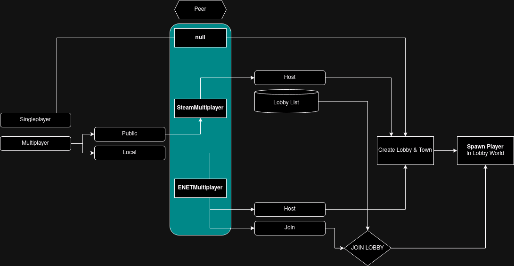

# Godot Steam PTP Template

### Usage:
* Godot 4.x version required
* This is NOT a multiplayer steam solution it's just a template

### Features
* Steam Peer To Peer Multiplayer Support
* Local Multiplayer Support (Used For Testing Your Game)
* Singleplayer Support

### Resources & What is used in project
* [Godot Steam](https://godotsteam.com)
* Basic FPS Player (Plugin By: sammburr)
* documentation is on the way
